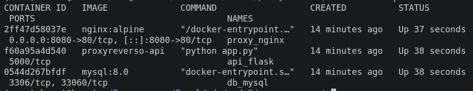

# Infraestrutura Web Containerizada: Nginx (Proxy Reverso) + API REST (Flask) + MySQL

## Integrantes

| Nome |
|------|
| Ariane de Souza Franca | 
| Lívia Martins Bastos |
| José Henrique Martins |
| Lamartine |

---

## Descrição do Projeto

Este projeto simula uma arquitetura de infraestrutura web de três camadas (Proxy, Aplicação e Banco de Dados) utilizando Docker Containers e Docker Compose. 

O Nginx atua como Proxy Reverso, sendo o único ponto de entrada exposto, redirecionando o tráfego HTTP para a API REST em Python (Flask). A API processa as requisições e se conecta ao MySQL para persistência de dados. Toda a comunicação interna ocorre dentro de uma rede virtual isolada do Docker.

### Arquitetura e Fluxo

Foto do meu PC Rodando



---

## Tecnologias Utilizadas

- Proxy Reverso: Nginx (nginx:alpine)
- Backend API: Python 3.10 + Flask + flask-mysqldb
- Banco de Dados: MySQL 8.0
- Orquestração e Rede: Docker & Docker Compose
- Persistência de Dados: Volume de Dados do Docker (db_data)

---

## Estrutura do Repositório

```


├── docker-compose.yml       # Orquestração dos 3 containers e redes
├── README.md                # Documentação da infraestrutura e testes
├── api/
│   ├── app.py               # Rotas e regras de negócio
│   ├── database.py          # Conexão com o banco de dados
│   ├── Dockerfile           # Imagem customizada da API Flask
│   └── requirements.txt     # Dependências Python
├── database/
│   └── schema.sql           # Script de inicialização das tabelas
├── nginx/
│   └── api.conf             # Configuração do Proxy Reverso
└── docs/
    └── rotas.md             # Especificação dos endpoints

```

## Pré-requisitos

- Docker instalado (docker --version)
- Docker Compose V2 instalado (docker compose version)

---

## Guia de Execução

Toda a infraestrutura é criada e configurada automaticamente em apenas um comando através do Docker Compose.

### 1. Clonar o repositório e acessar a pasta

git clone https://github.com/HenriqueMart/proxyreverso
cd proxyreverso

### 2. Subir o ambiente

Execute o comando a seguir para construir as imagens e iniciar os 3 containers em segundo plano:

docker compose up --build -d

### 3. Verificar o status dos containers

Para confirmar se todos os 3 containers estão em execução:

docker compose ps

---

## Testes de Validação

Os comandos abaixo podem ser executados no terminal da sua máquina hospedeira.

### 1. Testando as Rotas da API (via Nginx na porta 8080)

#### Clientes

# Cadastrar um novo cliente (POST)
curl -X POST http://localhost:8080/clientes \
  -H "Content-Type: application/json" \
  -d '{"nome": "João Silva", "email": "joao@email.com"}'

# Listar todos os clientes (GET)
curl http://localhost:8080/clientes

# Buscar cliente por ID (GET)
curl http://localhost:8080/clientes/1

# Atualizar cliente (PUT)
curl -X PUT http://localhost:8080/clientes/1 \
  -H "Content-Type: application/json" \
  -d '{"nome": "João Atualizado", "email": "joao@email.com"}'

# Deletar cliente (DELETE)
curl -X DELETE http://localhost:8080/clientes/1

#### Produtos

# Cadastrar um novo produto (POST)
curl -X POST http://localhost:8080/produtos \
  -H "Content-Type: application/json" \
  -d '{"nome": "Notebook", "preco": 3500.00, "estoque": 10}'

# Listar todos os produtos (GET)
curl http://localhost:8080/produtos

---

### 2. Comprovação do Isolamento de Rede

Os serviços da API (porta 3000) e do MySQL (porta 3306) não expõem portas externas. Eles operam isoladamente dentro da rede virtual rede_app.

# Tentativa de acesso direto à API (Porta 3000) -> Conexão recusada
curl http://localhost:3000/clientes

# Tentativa de acesso direto ao MySQL (Porta 3306) -> Conexão recusada
curl http://localhost:3306

